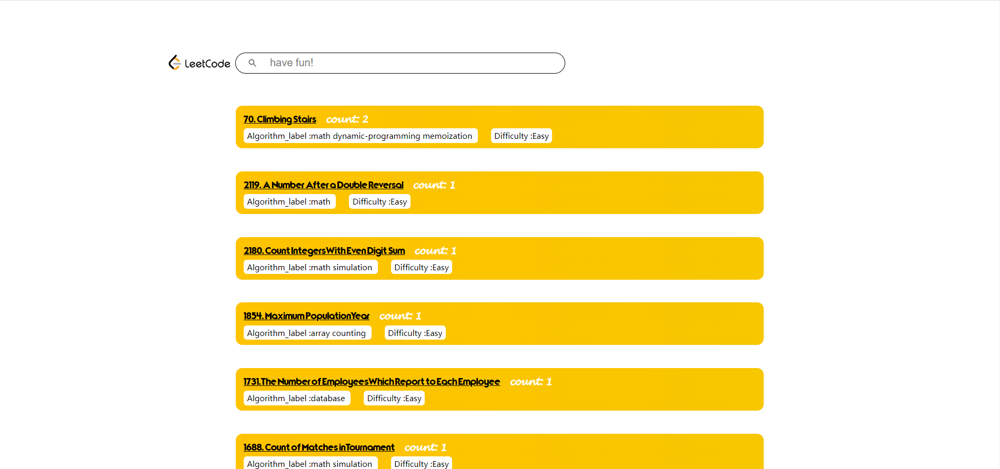
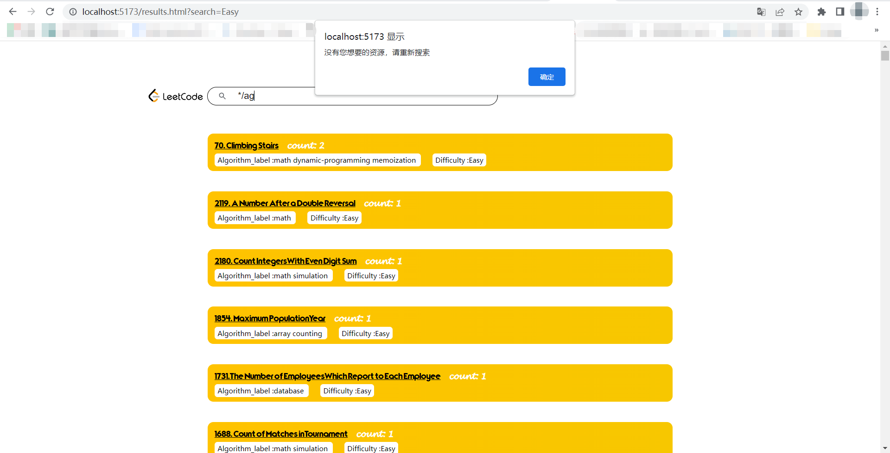

# 基于云和MapReduce的文本检索

> **组员：马光煜 姚隽熠**

[](https://github.com/docker/compose)

## 项目介绍

本项目是一个基于MapReduce的倒排索引系统，使用了Docker部署，前端使用vue，后端使用Go语言开发，实现一个高效的倒排索引系统，可以快速地搜索和查找关键词。我们使用了力扣的题目数据，并对文本进行了处理，以实现更高效的搜索和查找。

## 开发环境

### 前端部分

#### 环境

[]() []()

#### 语言

[]() []() []() []()

### 后端部分

`go1.19.6`  `Hadoop 2.10.1 `  `redis 7.2` `Sqlite3` 

## 项目细节

### 倒排索引介绍

#### 什么是正排索引

正派索引建立着文档与单词之前的映射，类似于下面这样

```
.正排索引： 由文档指向关键词

 文档--> 单词1 ,单词2

单词1 出现的次数  单词出现的位置； 单词2 单词2出现的位置  ...
```


#### 倒排索引

倒排索引（Inverted Index）是一种常用的文本索引数据结构，用于加快文本搜索和信息检索的速度。它是一种反转（Inverted）的索引结构，将文档中的每个单词映射到包含该单词的文档列表。

通常，倒排索引由两个主要组成部分构成：词项表（Term Dictionary）和倒排列表（Inverted List）。

1. 词项表（Term Dictionary）：词项表是一个词项到倒排列表的映射，它记录了所有不重复的单词（或词项）以及它们对应的倒排列表的位置信息。

2. 倒排列表（Inverted List）：倒排列表包含了一个单词在文档集合中的出现位置。对于每个单词，倒排列表记录了包含该单词的文档的标识符（例如文档ID）以及该单词在文档中的位置信息（例如单词出现的位置或出现的频率）。

例如有7个txt文件里涉及到与Hadoop有关的内容，我们想对`hadoop` `hdfs` `mapreduce`进行倒排索引，最终想要的结果可能是这样的


### 前端设计

**文件目录**
```bash
│  .dockerignore
│  Dockerfile
│  index.html
│  package-lock.json
│  package.json
│  results.html
│  server.js
│  vite.config.js
│
├─public
│      favicon-16x16.png
│      icon_search.svg
│      leetcode.png
│      title.ttf
│
└─src
    └─assets
            base.css
            main.css
```

**文件介绍**

index.html和results.html为主要的交互页面

public目录存放一些公共的图片和字体文件

src/assets目录存放css样式

.dockerignore和Dockerfile文件用来生成镜像

server.js用来本地调试启动应用

package.json用来配置项目依赖，package-lock.json是由package.json自动生成

**交互设计**

1. index.html输入查询语句，使用POST发送请求给后端
2. 后端响应并将查询结果返回
3. index.html将后端返回的数据POST发送给result.html进行解析并展示


index.html

包含一个搜索框，单击“搜索”或者回车进行搜索


result.html

包含一个搜索框，单击“搜索”或者回车进行搜索，并会将返回的数据显示出来，返回数据的顺序按照count数量从大到小排列，数据包括题目ID、题目名称、关键字出现次数、算法标签、难度标签。通过单击显示的题目可以链接到对应的leetcode题目网页。



**错误处理**

当查询为空或者返回数据不成功时则会弹窗并刷新页面



### 后端设计

**后端部分的最终目的是建立一个单词与文章的映射，并给前端提供查询接口**

文件目录

```txt
│  Dockerfile
│  go.mod
│  go.sum
│  LICENSE
│  mapper.go
│  questions.db
│  README.md
│  reducer.go
│  result2.txt
│  result3.txt
│  result4.txt
│  Sqlite_test.go      
├─img
│      image-20230529152714576.png
│      image-20230529152828238.png
│      image-20230529152911545.png
│      image-20230529152953565.png
│      image-20230531154903383.png
│      
└─main
        input.txt
        main.go
        questions.db
        result1.txt
        

```


#### 1. 数据准备

本次实验我们爬取了leetcode的题目数据，原因有两点

1. leetcode题目格式清晰，分成标题，题目内容，难度，算法标签，题目ID这几个部分

2. leetcode网站获取题目的API是基于`graphql`设计的，这意味着爬取leetcode题目非常方便，不用担心各种奇怪的反爬措施

   例如我们在浏览器输入：

   ```json
   https://leetcode.com/graphql?query=query
   {     
         userContestRanking(username:  "YOUR_USERNAME") 
         {
           attendedContestsCount
           rating
           globalRanking
           totalParticipants
           topPercentage    
         }
         userContestRankingHistory(username: "YOUR_USERNAME")
         {
           attended
           trendDirection
           problemsSolved
           totalProblems
           finishTimeInSeconds
           rating
           ranking
           contest 
           {
             title
             startTime
           }
         }
   } 
   ```

   可以得到结果：

   

   查看爬到的数据并存到数据库里：

   

   将数据处理为一个文件准备进行mapreduce的分词

   


#### 2. Hadoop Mapreduce分词

处理好数据之后，需要使用mapreduce进行分词

根据Hadoop streaming 的规则，只要我们使用标准的输入输出，并可以不限于java，由于本人对Go语言比较熟悉，所以选择Go语言编写mapreduce的程序

mapper.go：

```go
package main

import (
        "bufio"
        "fmt"
        "os"
        "strings"
)

func main() {
        scanner := bufio.NewScanner(os.Stdin)
        for scanner.Scan() {
                line := scanner.Text()
                parts := strings.SplitN(line, " ",2)
                if len(parts) == 2 {
                        docID := parts[0]
                        text := parts[1]
                        words := strings.Split(text, " ")
                        for _, word := range words {
                                fmt.Printf("%s %s\n", word, docID)
                        }
                }
        }
        if scanner.Err() != nil {
                fmt.Fprintln(os.Stderr, "Error reading standard input:", scanner.Err())
                os.Exit(1)
        }
}
```

在map阶段，我们按行读取内容，并将处理后的内容分为docId 和单词，并使用标准输入输出进行输出方便后续reduce处理

reducer.go：

```go
package main

import (
        "bufio"
        "fmt"
        "os"
        "strings"
)

func main() {
        currentWord := ""
        currentCounts := make(map[string]int)

        scanner := bufio.NewScanner(os.Stdin)
        for scanner.Scan() {
                line := scanner.Text()
                parts := strings.Split(line, " ")
                if len(parts) == 2 {
                        word := parts[0]
                        docID := parts[1]
                        if currentWord != "" && currentWord != word {
                                printCounts(currentWord, currentCounts)
                                currentCounts = make(map[string]int)
                        }
                        currentWord = word
                        currentCounts[docID]++
                }
        }
        if currentWord != "" {
                printCounts(currentWord, currentCounts)
        }

        if scanner.Err() != nil {
                fmt.Fprintln(os.Stderr, "Error reading standard input:", scanner.Err())
                os.Exit(1)
        }
}

func printCounts(word string, counts map[string]int) {
        var pairs []string
        for docID, count := range counts {
                docID = strings.TrimSpace(docID)
                pairs = append(pairs, fmt.Sprintf("(%s,%d)", docID, count))
        }
        fmt.Printf("%s %s\n", word, strings.Join(pairs, ","))
}
```

reducer.go中，依旧是读取每一行，接着使用一个map结构来计算单词在一个文章中出现的次数，并使用标准输入输出进行输出

最后我们输出的结果是：


最后将其合并为一个文件，可以看到确实有的单词在一篇文章中出现了多次


#### 3. 将数据排序并加载进redis

到目前为止，我们已经建立了单词到文章的映射，但是还没有排序，我们希望可以将最相关的题目显示到最前面，这个事情可以在前端做，也可以在后端做，但是本次作业我们在后端完成了这个功能。

redis是一个内存数据库，但是查询性能会比基于硬盘和索引的数据库更快一些。所以在项目启动时我们需要将数据加载进内存

具体来说，我们读取处理好的单词与文章的映射，并根据单词在某个文章中出现的次数对其进行排序

例如，某一行数据在处理前是

```
BST (783,1),(938,1),(1373,1),(530,2),(538,1)	
```

那么处理后这一行数据变为

```
BST (530,2),(783,1),(938,1),(1373,1),(538,1)	
```

并将其加载进了redis中

经过这样的处理，就彻底完成了单词到文章根据单词出现次数排序的KV映射

#### 4. 后端Dockerfile

Dockerfile具体为：

```dockerfile
# 使用 Golang 官方提供的 Golang 镜像作为基础镜像
FROM golang:1.19

# 设置工作目录
WORKDIR /work

# 复制整个项目到工作目录
COPY . .

# 复制 go.mod 和 go.sum 文件到工作目录
RUN go mod download

# 执行 test.go 中的 test_1 函数
RUN go test -run Test_Convet_TXT_2_Redis
# 执行 main.go
expose 9999
CMD ["go", "run", "main/main.go"]


```

其中重要的一步是要先执行`RUN go test -run Test_Convet_TXT_2_Redis` 将数据加载进内存，再启动我们的http服务器

### 调试和运行
**前端本地调试**

切换到前端网页根目录
```bash
cd front
```
安装依赖
```bash
npm install
```
启动应用
```bash
node server.js
```
访问localhost:5173即可

**docker-compose一键部署**

本程序运行所需要的三个镜像已经上传至Docker Hub，直接拉取使用即可。

编写docker-compose.yml文件

```yaml
version: '3.8'
services:
  backend:
    image: merk11/search-engine:backend
    ports:
      - 9999:9999
    networks:
      - mynetwork
    depends_on:
      - db
  db:
    image: merk11/search-engine:redis
    ports:
      - 6379:6379
    networks:
      - mynetwork	
  front:
    image: merk11/search-engine:front
    ports:
      - 5173:5173
    networks:
      - mynetwork

networks:
  mynetwork:
    driver: bridge
```

在docker-compose.yml文件目录下执行命令

```bash
docker-compose up
```

即可拉取镜像，并启动服务，访问localhost:5173即可。
